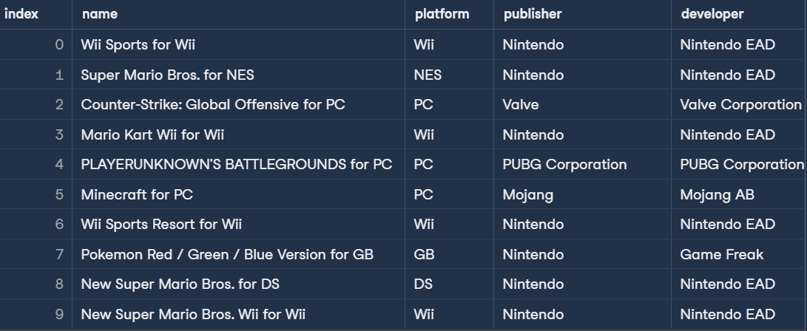
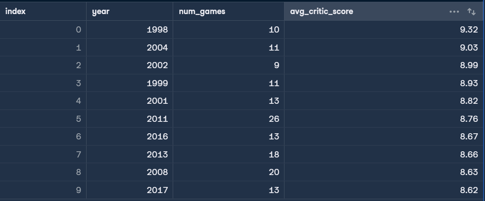
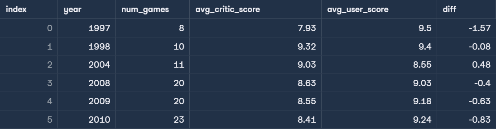

# Output of finding top 10 best_selling_games

##Query:
SELECT \*
FROM game_sales
ORDER BY games_sold desc
LIMIT 10;

##Result:

# Output of finding the ten years with the highest average critic score, where at least four games were released (to ensure a good sample size)

##Query:
SELECT g.year, COUNT(g.name) as num_games, ROUND(AVG(critic_score),2) as avg_critic_score
FROM game_sales as g
INNER JOIN reviews as r
USING(name)
GROUP BY g.year
HAVING COUNT(g.name)>4
ORDER BY avg_critic_score DESC
LIMIT 10;

##Result:

# Output of finding the years where critics and users broadly agreed that the games released were highly rated. Specifically, the years where the average critic score was over 9 OR the average user score was over 9.

##Query:
SELECT u.year,
u.num_games,
c.avg_critic_score,
u.avg_user_score,
(c.avg_critic_score - u.avg_user_score) AS diff
FROM public.users_avg_year_rating AS u
INNER JOIN public.critics_avg_year_rating AS c
USING (year)
WHERE u.avg_user_score > 9 OR c.avg_critic_score > 9
ORDER BY u.year;

##Result:

